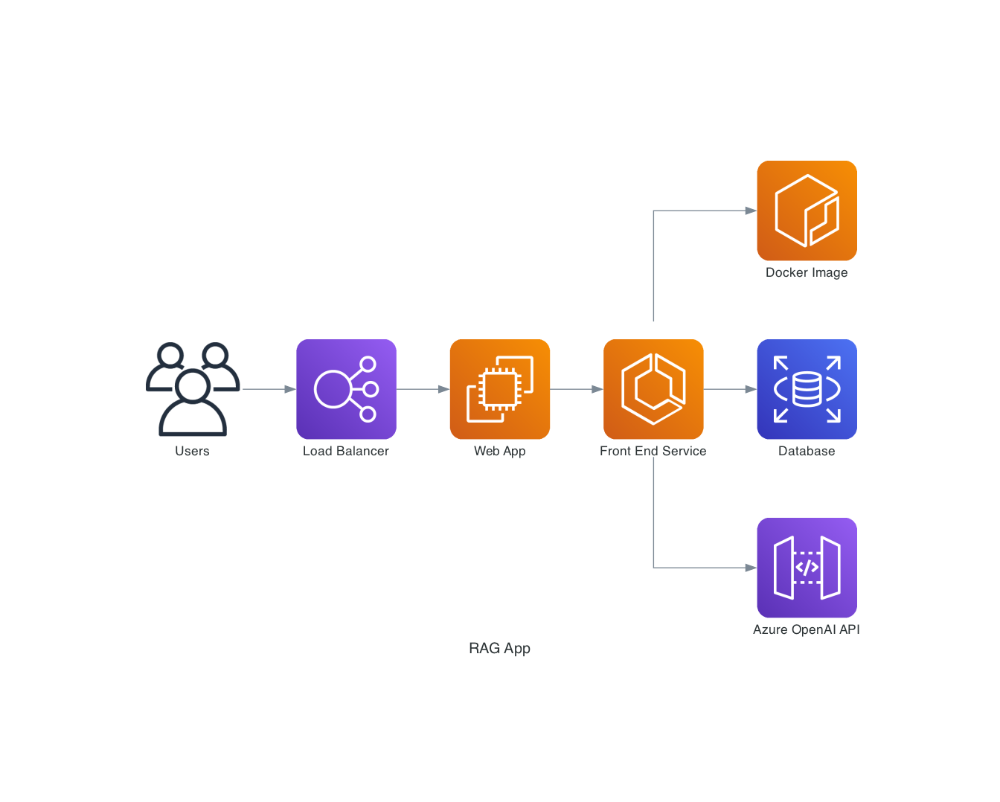

# Your Digital Architect

**Khajan Pandey** is a Solution Architect with over a decade of experience designing resilient, high-impact systems. I specialize in bridging the gap between complex business challenges and elegant technical execution.

Based in **Guadalajara, Mexico**, I combine my Bharat roots with the speed of the North American tech ecosystem to build products that scale globally.

## The Strategy: Architecting Intelligence

I don't just build apps; I architect **Intelligence Systems**. In the age of AI, the value shift has moved from simple automation to **Agentic Autonomy**. 

My current focus lies at the intersection of:
* **Agentic Workflows:** Moving beyond static prompts to self-correcting AI agents.
* **Multi-Modal RAG:** Architecting systems that "see" and "read" across diverse data formats.
* **Scalable Transformation:** Leading legacy systems into the modern AI-first era.

<!--  -->

## Thought Leadership & Technical Edge

I believe an architect's role is to provide **Context** where there is noise and **Insights** where there is data. 

### My Core Pillars:
* **AI/ML Strategy:** Designing GPT-powered applications that leverage Retrieval Augmented Generation (RAG) for precision.
* **Mobile Excellence:** Crafting intuitive BDD Apps.
* **Systems & Design Thinking:** Designing large-scale ecosystems where software is the primary driver of revenue and operational efficiency. I focus on the "Big Picture"—ensuring technical architecture aligns with business P&L to deliver sustainable value.

> "The future of AI isn't just a smarter chatbot; it's a seamless integration of context and action."

## Let’s Build Something Great

Whether you are looking for a deep technical dive or a strategic digital roadmap, let's start the conversation.

**Direct Connection:**
```bash
hola@khajanpandey.com