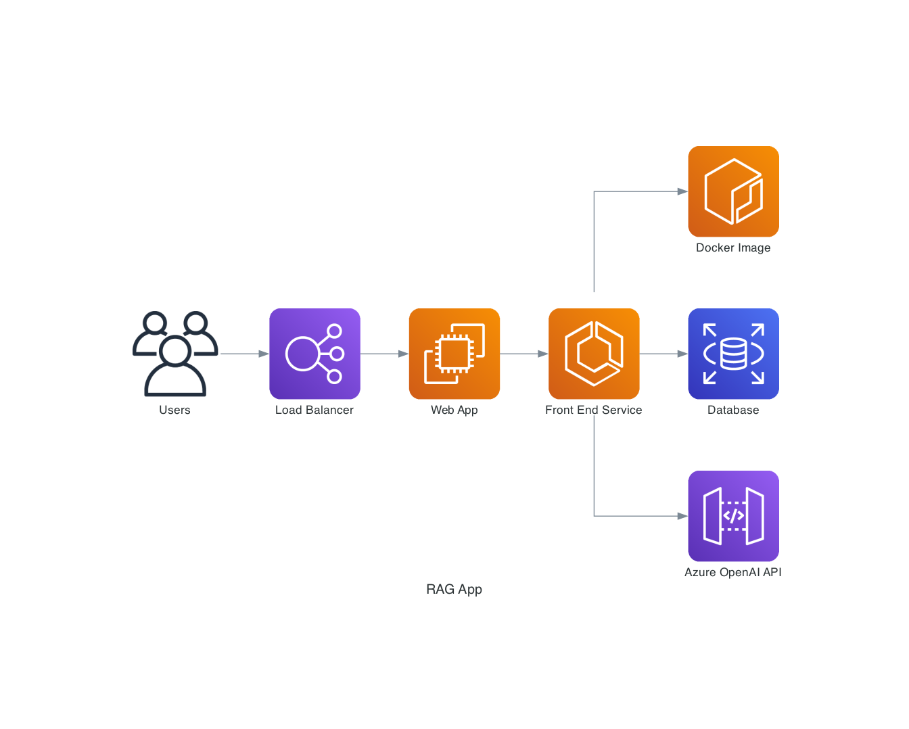

import TypingTitle from '@site/src/components/TypingTitle'

#
<TypingTitle words={["Blueprints of Intelligence", "Crafting Context: The AI Edge","Systems Alchemist"]} />
# 

**Khajan Pandey** is a Solution Architect with over a decade of experience designing resilient, high-impact systems. I specialize in bridging the gap between complex business challenges and elegant technical execution.

Currently based in **Tijuana, Mexico**, I combine my Bharat roots with fast paced tech ecosystem to build products that scales.

<div align="center">
	
</div> 

## The Strategy: Architecting Intelligence
The value shift in technology means that technical expertise alone is no longer enough; true impact comes from understanding the "why" behind solutions. I architect and build **Intelligent Systems**—where the ability to unlearn, relearn, and adapt is more powerful than relying solely on hard skills. 
Automation now extends to **complex NLU and seamless integration with tools**, redefining what it means to build for the future.

My current focus lies at the intersection of:
* **Agentic Workflows:** Moving beyond static prompts to self-correcting AI agents.
* **Multi-Modal:** Architecting systems that "see" and "read" across diverse data formats.
* **Scalable Transformation:** Leading legacy systems into the modern AI-first era.

<!--  -->

## Thought Leadership & Technical Edge

I believe an architect's role is to provide **Context** where there is noise and **Insights** where there is data. 

### My Core Pillars:
* **AI/ML Strategy:** Designing GPT-powered applications that leverage Retrieval Augmented Generation (RAG) for precision.
* **Mobile Excellence:** Crafting intuitive BDD Apps.
* **Systems & Design Thinking:** Designing large-scale ecosystems where software is the primary driver of revenue and operational efficiency. I focus on the "Big Picture"—ensuring technical architecture aligns with business P&L to deliver sustainable value.


## Let’s Build Something Great

Whether you are looking for a deep technical dive or a strategic digital roadmap, let's start the conversation.

**Shoot Email:**
```bash
hola@khajanpandey.com
```